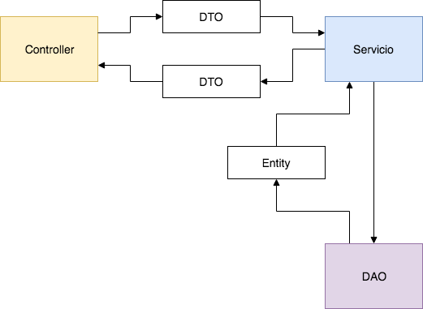

# PetITAPI

Repositorio para almacenar los servicios **REST o API** para el proyecto PetIT.
Este proyecto está realizado usando IntelliJ y  SpringBoot

## Tecnologías
Las tecnologías ocupadas para este proyecto son:

- Oracle Java 8 (tener muy en cuenta)
- IntelliJ
- SpringBoot
- mvn

## Rutas
A continuación se presenta el listado de rutas

#### POST /login
- Ruta para iniciar sesión con el sistema. Retorna un token y los datos del usuario
- rut: rut del usuario
- password: contraseña del usuario
 
#### /api/*
- Todas las rutas que no deben ser públicas están bajo /api/
- Para poder consultar y obtener una respuesta de estas rutas es necesario enviar el JWT en la cabecera de la petición, usando una cabecera de Autenticación Bearer 
- ** authorization: Bearer XXXX **

#### GET /api/comuna
- Obtiene el listado de comunas completo 

#### GET /api/comuna/{idComuna}
- Obtiene una comuna en particular
- El id de la comuna se pasa por la URL 
- idcomuna: int

#### GET /api/comuna/provincia/{idProvincia}
- Obtiene las comunas de una provincia en particular
- El id de la provincia se pasa por la URL 
- idprovincia: int

#### GET /api/region
- Obtiene el listado de comunas completo 

#### GET /api/region/{idRegion}
- Obtiene una región en particular
- El id de la región se pasa por la URL 
- idregion: int

#### GET /api/provincia
- Obtiene el listado de las provincias completo 

#### GET /api/provincia/{idProvincia}
- Obtiene una provincia en particular
- El id de la provincia se pasa por la URL 
- idprovincia: int

#### GET /api/provincia/region/{idRegion}
- Obtiene las provincias de una región en particular
- El id de la región se pasa por la URL 
- idregion: int

#### GET /api/rol
- Obtiene el listado de los roles registados por defecto en el sistema

#### GET /api/rol/{idrol}
- Obtiene una rol en particular
- El id del rol se pasa por la URL 
- idrol: int

#### GET /api/raza
- Obtiene el listado de los roles registados por defecto en el sistema

#### GET /api/raza/{idRaza}
- Obtiene una raza en particular
- El id de raza se pasa por la URL 
- idraza: int

#### GET /api/dueno
- Obtiene el listado de los dueños de mascotas registados en el sistema

#### GET /api/dueno/{idDueno}
- Obtiene un dueño en particular
- El id del dueño se pasa por la URL 
- iddueno: int

#### POST /api/dueno/
- SIN IMPLEMENTAR
- Guarda un dueño en particular

####PUT /api/dueno/{idDueno}
- Edita un dueño en particular
- El id del dueño se pasa por la URL 
- iddueno: int

####DELETE /api/dueno/{idDueno}
- Elimina un dueño en particular
- El id del dueño se pasa por la URL 
- iddueno: int

#### GET /api/mascota
- Obtiene el listado de las mascotas registradas el sistema

#### GET /api/mascota/{idmascota}
- Obtiene una mascota en particular
- El id de la mascota se pasa por la URL 
- idmascota: int

#### GET /api/notificacion
- Obtiene todas las notificaciones del sistema

#### GET /api/notificacion/{idNotificacion}
- Obtiene una notificación específica del sistema
- El id de la notificación se pasa por la URL 
- idnotificacion: int

#### PUT /api/notificacion/marcar/{idNotificacion}
- Marca como leía  una notificación específica del sistema
- El id de la notificación se pasa por la URL 
- idnotificacion: int

#### POST /api/notificacion/
- Guarda una notificación en el sistema

#### PUT /api/notificacion/{idNotificacion}
- Edita una notificación específica del sistema
- El id de la notificación se pasa por la URL 
- idnotificacion: int

#### DELETE /api/notificacion/{idNotificacion}
- Elimina una notificación específica del sistema
- El id de la notificación se pasa por la URL 
- idnotificacion: int

#### GET /api/mascota/tipo
- Obtiene el listado de los tipos de mascotas registradas el sistema por defecto

#### GET /api/mascota/tipo/{idTipoMascota}
- Obtiene un tipo de mascota en particular
- El id del tipo de mascota se pasa por la URL 
- idTipoMascota: int

#### GET/POST/PUT/DELETE muchas rutas más :s

## Patrón de Diseño
El patrón de diseño usado en este desarrollo es MVC. Sin embargo, presenta una variable en dónde se integran nuevos componentes en las capas. Un diagrama a continuación:

### Models

#### DTOS

- Estas clases son finalmente objetos de transporte de datos
- Su objetivo es compartir datos en la aplicación, transportar, compartir entre las distintas capas

#### Entities

- Estas clases están direcamente relacionadas con las entidades de la base de datos
- Son una repressentación de la base de datos fidedignamente
- Además se agregan las relaciones como una propiedad en la clase (revisar)

### Persistence

#### DAOS

El objetivo de esta capa es:

- Obtiene los datos usando el JPA

### Services

El objetivo de esta capa es:

- Obtiene los datos consultando a los DAOS

## Cómo aportar
- Crear otra rama
- Programar las rutas que falten
- Subir al repositorio =)