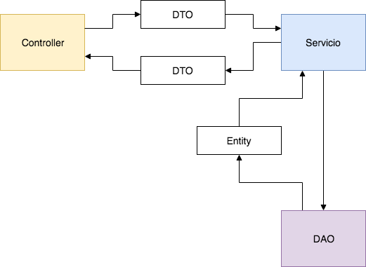

# PetITAPI

Repositorio para almacenar los servicios REST o API para el proyecto PetIT.
Este proyecto está realizado usando IntelliJ y  SpringBoot

## Rutas 
A continuación se presenta el listado de rutas

#### POST /login
- Ruta para iniciar sesión con el sistema
- Retorna un token JWT
 
#### /api/*
- Todas las rutas que no deben ser públicas están bajo /api/
- Para poder consultar y obtener una respuesta de estas rutas es necesario enviar el JWT en la cabecera de la petición, usando una cabecera de Autenticación Bearer 
- ** authorization: Bearer XXXX **
#### GET /api/comuna
- Obtiene el listado de comunas completo 

#### GET /api/comuna/{idcomuna}
- Obtiene una comuna en particular
- El id de la comuna se pasa por la URL 
- idcomuna: int
#### GET/POST/PUT/DELETE muchas rutas más :s
## Patrón de Diseño
El patrón de diseño usado en este desarrollo es MVC. Sin embargo, presenta una variable en dónde se integran nuevos componentes en las capas. Un diagrama a continuación:

### Models
#### DTOS
- Estas clases son finalmente objetos de transporte de datos
- Su objetivo es compartir datos en la aplicación, transportar, compartir entre las distintas capas

#### Entities
- Estas clases están direcamente relacionadas con las entidades de la base de datos
- Son una repressentación de la base de datos fidedignamente
- Además se agregan las relaciones como una propiedad en la clase (revisar)

### Persistence
#### DAOS
El objetivo de esta capa es:
- Obtiene los datos usando el JPA

### Services
El objetivo de esta capa es:
- Obtiene los datos consultando a los DAOS

## Tecnologías
Las tecnologías ocupadas para este proyecto son:

- IntelliJ
- SpringBoot
- mvn

## Cómo aportar
- Crear otra rama
- Programar las rutas que falten
- Subir al repositorio =)